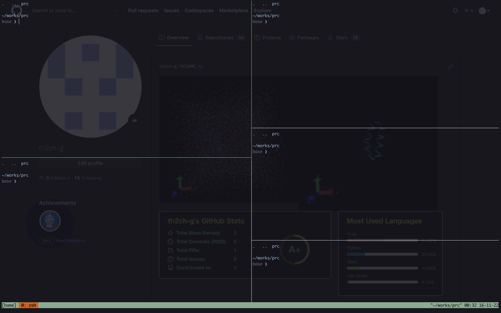

# dotfiles

- [dotfiles](#dotfiles)
  - [Install](#install)
    - [For me](#for-me)
    - [For Guest](#for-guest)
    - [From Dockerfile](#from-dockerfile)
      - [Case1: Pull from ghcr](#case1-pull-from-ghcr)
      - [Case2: Build locally](#case2-build-locally)
  - [Update](#update)
    - [Simple](#simple)
    - [Overwrite](#overwrite)
    - [Submodule update](#submodule-update)
  - [Contents](#contents)

## Install
### For me
~~~shell
git clone --depth 1 --branch main --recursive -j 8 https://github.com/th2ch-g/dotfiles.git && \
cd ./dotfiles && \
./install.sh -b -c -p -v -z -t -g -n
~~~

### For Guest
~~~shell
git clone --depth 1 --branch main --recursive -j 8 https://github.com/th2ch-g/dotfiles.git && \
cd ./dotfiles && \
./install.sh --zsh --vim --tmux
~~~

### From Dockerfile
#### Case1: Pull from ghcr
~~~shell
docker pull ghcr.io/th2ch-g/dotfiles:latest
docker run --rm -it ghcr.io/th2ch-g/dotfiles zsh
~~~

#### Case2: Build locally
- If you want to use as guest, change Dockerfile
~~~shell
git clone --depth 1 --branch main --recursive -j 8 https://github.com/th2ch-g/dotfiles.git && \
docker image build -t myenv dotfiles/docker && \
docker run --rm -it myenv zsh
~~~

## Update
### Simple
~~~
git pull origin main
~~~

### Overwrite
~~~
git fetch origin main && \
git reset --hard origin/main
~~~

### Submodule update
~~~
git submodule update --remote <submodule_path>
~~~

## Contents
- [vim](https://github.com/vim/vim) (>= v8.2 tested)
  - [vim-plug](https://github.com/junegunn/vim-plug)
- [neovim](https://github.com/neovim/neovim) (>= v0.10.4 tested)
  - [lazy.nvim](https://github.com/folke/lazy.nvim)
- [zsh](https://github.com/zsh-users/zsh) (>= v5.8 tested)
  - [zsh-syntax-highlighting](https://github.com/zsh-users/zsh-syntax-highlighting)
  - [zsh-completions](https://github.com/zsh-users/zsh-completions)
  - [zsh-autosuggestions](https://github.com/zsh-users/zsh-autosuggestions)
  - [prezto](https://github.com/sorin-ionescu/prezto)
  - [pure](https://github.com/sindresorhus/pure)
- [tmux](https://github.com/tmux/tmux) (>= 3.0a tested)
- [iTerm2](https://github.com/gnachman/iTerm2)
  - [Iceberg-iTerm2](https://github.com/Arc0re/Iceberg-iTerm2)
- mytools
- [brew](https://github.com/Homebrew/brew)
- cargo
- docker
- others
